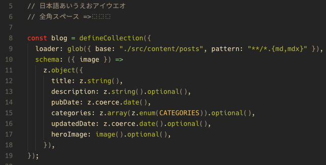
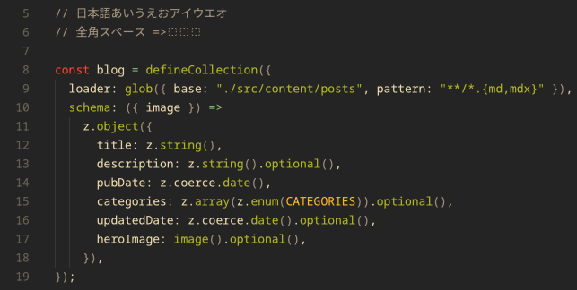

こんにちは、フリーランスエンジニアの太田雅昭です。

# Zedの全角スペース対応状況

zedは、半角スペースの可視化には対応しています。

```
"show_whitespaces": "all",
```

しかし2025/12/02現在、Zedは全角スペースの可視化に対応していません。これは日本人にとっては由々しき問題です。過去にissueが建てられていたようですが、対応はされていないようです。（Claude談）

# 全角スペース可視のフォントを使用する

そこで、全角スペースが可視化されているフォントを使用することにしました。今回試したのは以下の３つです。

- HackGen35
- NOTONOTO35
- PlemolJP35

スクリーンショットを撮って見ました。

HackGen35

NOTONOTO35

PlemolJP35


見た感じ、HackGen35がはっきりしていて見やすそうです。
Zed標準のフォントも見やすかったのですが、致し方ないですね。

HackGenは以下からダウンロードできます。

https://github.com/yuru7/HackGen
