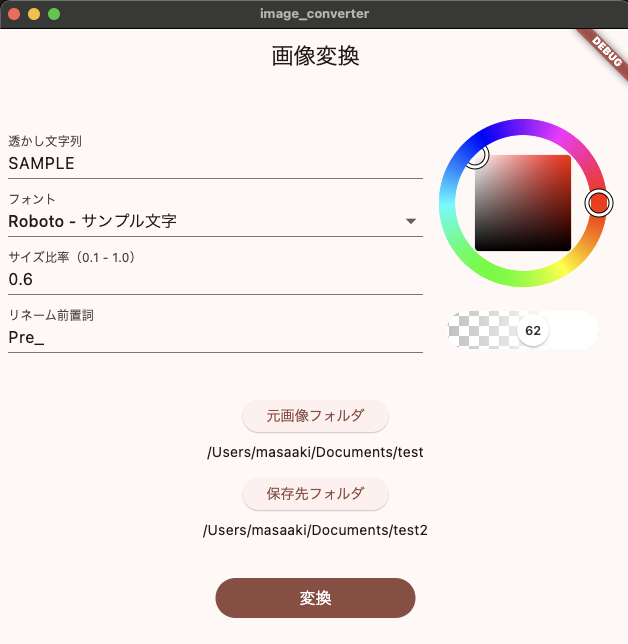

画像変換ツールを作成しました

## 概要

画像の一括処理を行うデスクトップアプリケーション。
複数の画像ファイルに対して、透かし追加・リネーム・リサイズ・CSV出力などの処理を一括で実行できます。

## 対応プラットフォーム:

- Mac
- Windows

## 主な機能:

- 画像への透かし文字追加（フォント・色・透明度のカスタマイズ可能）
- 連番付きの一括リネーム
- 画像サイズの一括リサイズ
- ファイル名リストのCSV出力
